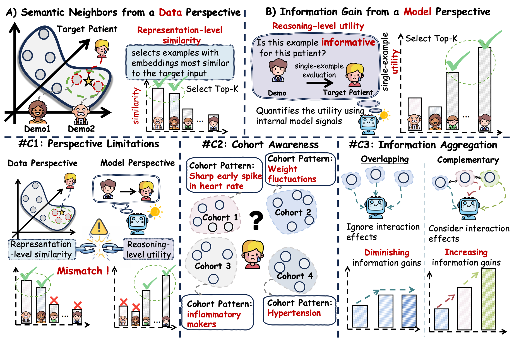
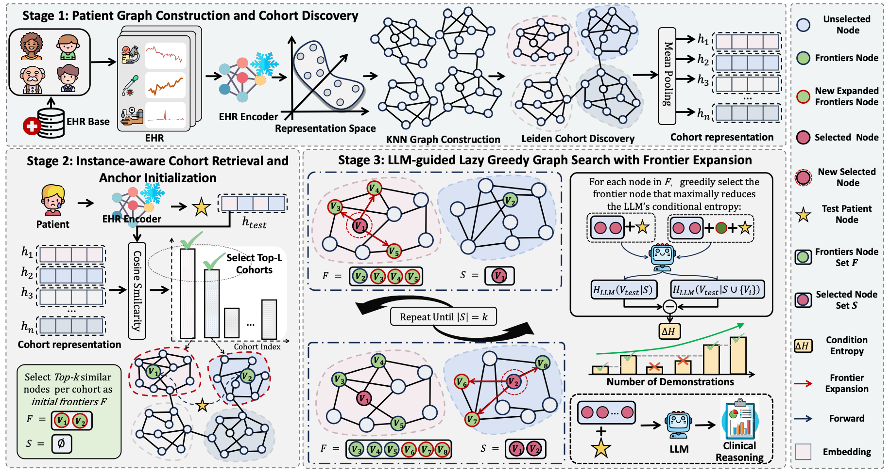

# 🚶 GraphWalker

**GraphWalker** is a graph-guided in-context learning (ICL) framework for clinical reasoning with large language models (LLMs) on electronic health records (EHRs).  
It selects informative and complementary demonstrations by jointly modeling **patient-level clinical similarity**, **cohort-level population structure**, and **LLM-estimated information gain**, following the methodology described in our ACL submission.

### Motivation



### Framework Overview



## 📋 Requirements

- 🐍 Python 3.10
- 🎮 CUDA 12.x (for GPU acceleration)
- 📦 Conda (recommended for environment management)

### 🤖 LLM Libraries

The framework relies on the following key LLM libraries (automatically installed via `environment.yml`):

- **vLLM** (v0.8.5): High-throughput LLM inference and serving engine with PagedAttention
- **Transformers** (v4.51.3): Hugging Face library for state-of-the-art NLP models
- **PyTorch** (v2.6.0): Deep learning framework with CUDA 12.x support

## 🛠️ Installation

### 1️⃣ Clone the repository

```bash
git clone <repository-url>
cd GraphWalker
```

### 2️⃣ Create and activate conda environment

```bash
conda env create -f environment.yml
conda activate ehrbase
```

Alternatively, if you prefer to use `environment_base.yml`:

```bash
conda env create -f environment_base.yml
conda activate ehrbase
```

### 3️⃣ Install additional dependencies (if needed)

If you need to install packages from `requirements.txt`:

```bash
pip install -r requirements.txt
```

## 🚀 Usage

### 💡 Basic Usage

Run the main script with command-line arguments:

```bash
cd src
python main.py \
    --dataset <dataset_name> \
    --method <method_name> \
    --llm_name <llm_model_name> \
    --seed 3407
```

### ✨ Example: Running GraphWalker

```bash
cd src
CUDA_VISIBLE_DEVICES=0,1 python main.py \
    --dataset mimic4_readmission \
    --llm_name qwen3-14b-instruct \
    --seed 3407 \
    --method graph_walker \
    --icl_examples_num 3 \
    --max_tokens_each_patient 10000 \
    --use_vllm \
    --period_length 24 \
    --embedding_model_name smart \
    --graph_walker_neighbor_num 4 \
    --graph_walker_top_l_cohorts 2 \
    --graph_walker_top_k_per_cohort 3 \
    --graph_walker_n_clusters 10
```

### 📊 Supported Datasets

- 📈 `mimic3_mortality`
- 📈 `mimic3_los`
- 📈 `mimic4_readmission`
- 📈 `cmb`
- 📈 `medqa`


### ⚙️ Key Arguments

- `--dataset`: 📁 Dataset to use (required)
- `--method`: 🔧 Method to run (required)
- `--llm_name`: 🤖 Name of the LLM model (required for LLM methods)
- `--seed`: 🌱 Random seed 
- `--period_length`: ⏱️ Period length for data processing (default: 48)
- `--max_tokens_each_patient`: 🔢 Maximum tokens per patient prompt (default: 10000)
- `--icl_examples_num`: 📝 Number of few-shot examples (default: 3)
- `--use_vllm`: ⚡ Use vLLM for inference (optional)
- `--toy_dataset`: 🧪 Use a smaller subset for testing (optional)


## ⚙️ Configuration

Before running, make sure to configure the following paths in `src/args/local_path_config.py`:

- 📂 Dataset paths
- 🤖 LLM model paths
- 🔤 Embedding model paths

## 📝 Notes

- 💻 The project requires GPU support for optimal performance
- ✅ Make sure your CUDA version is compatible with PyTorch and vLLM
- 🔄 For first-time setup, data preprocessing may be required depending on your dataset
