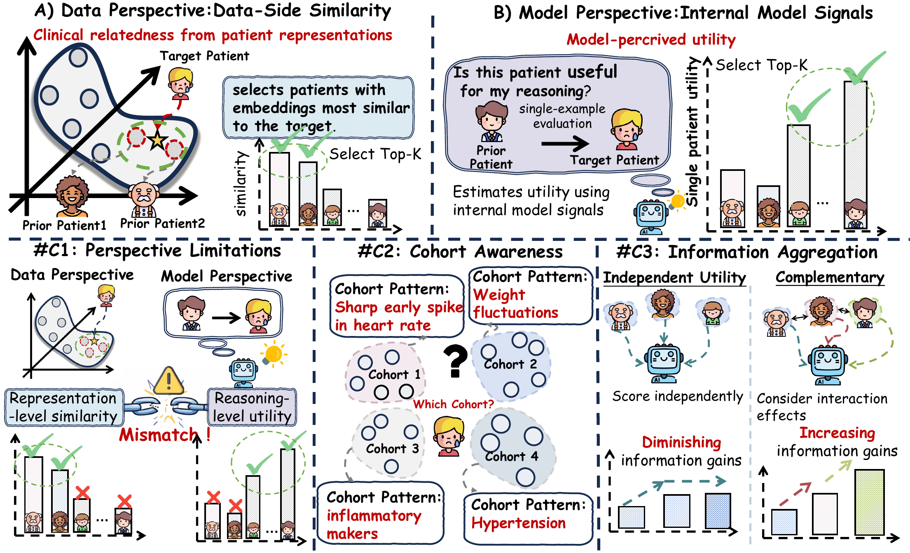
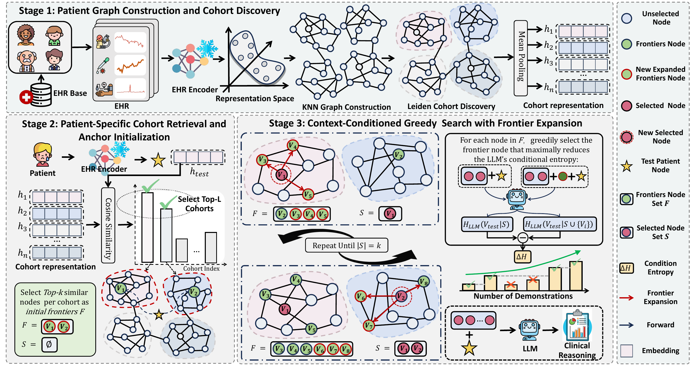

# GraphWalker

**GraphWalker** is a graph-guided in-context learning framework for predicting clinical outcomes from electronic health records. It combines patient representations, cohort retrieval, and full greedy frontier search to select informative demonstrations for a frozen LLM.

The accompanying paper is **The Doctor's Casebook: When LLMs Reason by Patient Analogy via Information Gain-Guided Graph Search**.

## Motivation



## Framework



## Installation

Local GraphWalker inference requires Linux and an NVIDIA GPU with sufficient memory for the chosen LLM. Dependencies are listed in [requirements.txt](requirements.txt).

Download and extract the repository, then run the following commands from its root directory:

```bash
conda create -n ehrbase python=3.10 pip -y
conda activate ehrbase
python -m pip install -r requirements.txt
```

## Usage

Prepare patient records as `longitudinal.jsonl` under the dataset directory, together with local LLM and pretrained SMART encoder checkpoints. The input format is defined in [src/data/longitudinal.py](src/data/longitudinal.py). Supply paths through command-line arguments or [src/args/local_path_config.py](src/args/local_path_config.py).

Run from the repository root:

```bash
CUDA_VISIBLE_DEVICES=0,1 python src/main.py \
    --dataset mimic4_readmission \
    --dataset_path /path/to/mimic4 \
    --method graph_walker \
    --llm_name qwen3-14b-instruct \
    --llm_local_path /path/to/Qwen3-14B \
    --use_vllm \
    --embedding_model_name smart \
    --embedding_model_path /path/to/smart/checkpoint-mse.pth \
    --vllm_max_model_len 20480 \
    --seed 3407 \
    --mid_data_dump_path ./mid_data \
    --metrics_save_path ./results/mimic4_readmission/seed-3407.json
```

For zero-shot prediction, use `--method llm_zero_shot` and omit the embedding arguments. View the full set of options with:

```bash
python src/main.py --help
```

Per-run metrics are saved to `--metrics_save_path`. Results across seeds can be aggregated with [summarize_seed_runs.py](src/scripts/graph_walker/summarize_seed_runs.py).

## Tests

```bash
python -m pip install -r requirements-test.txt
python -m pytest -q tests
```
